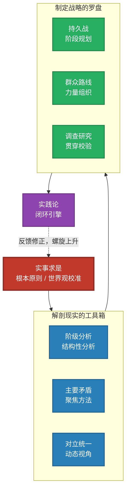

# 毛选思维框架 —— 看透本质的分析工作流

用系统化、结构化的思维框架深度剖析问题。**层与层之间**必须等待用户确认后方可进入下一阶段。

<HARD-GATE>
走完完整工作流之前，不要直接跳到结论、不要省略关键分析层。每个阶段的分析结论必须经过用户确认后才能推进到下一阶段。

**不要**执着于原文中的战争和政事语境。本框架是思维方法的提炼，重点是将底层方法论泛化应用于当代社会、商业和生活场景。
</HARD-GATE>

> 参考自《毛选的底层逻辑看透本质的思维框架 (周鸿仙) 》

---

## 框架速览



**四步链条**：实事求是（世界观校准）→ 阶级分析/主要矛盾/对立统一（解剖现实）→ 持久战/群众路线/调查研究（制定战略）→ 实践论（闭环迭代）

---

## 工作流（TODO 驱动）

**用户触发 skill 后，立即创建 TODO LIST 并展示给用户。** 这是整个分析的进度看板。

```markdown
## 📋 分析进度

- [ ] **阶段一**：实事求是 —— 理清事实
- [ ] **阶段二**：解剖现实 —— 分析利益与矛盾
  - [ ] 节点A：利益地图确认
  - [ ] 节点B：主要矛盾与动态分析确认
- [ ] **阶段三**：制定战略 —— 阶段规划与力量组织
- [ ] **阶段四**：闭环验证 —— 最小行动与迭代
```

**推进规则**：每完成一个阶段，更新 TODO（标记 completed），然后自动推进到下一阶段。用户要求回退时，更新 TODO 重新标记对应阶段为 in_progress。

---

### 阶段一：实事求是

> **定位**：一切正确思考的出发点。面对任何问题时，第一反应必须是"事实是什么？"而非"我觉得怎样？"
> **核心问题**：事实究竟是什么？
> **参考文档**：`references/01-shishi-qiushi.md` · `references/08-anli-ku.md#实事求是`
> **详细操作**：`references/00-workflow-guide.md#阶段一`

**你做什么**：
1. 主动发起对话，用具体问题引导用户描述（不要等用户先给一大段）
2. 边听边追问，主动识别信息缺口
3. 主动搜索公开信息补全用户视角（WebSearch / WebFetch）
4. 主动挑战片面性，区分事实与观点
5. 输出「已知事实清单」（事实 / 信息缺口 / 待剥离观点）

**用户确认什么**：事实清单是否准确？有无遗漏或误判？

**确认后**：更新 TODO → 阶段一 completed，阶段二 in_progress，进入阶段二。

---

### 阶段二：解剖现实

> **定位**：用阶级分析理清结构，找到矛盾，识别主要矛盾，再用对立统一做动态分析。
> **核心问题**：利益结构是什么？矛盾在哪里？牛鼻子是什么？
> **参考文档**：`references/02-jiejifenxi.md` `references/03-zhuyao-maodun.md` `references/04-duili-tongyi.md` · `references/08-anli-ku.md`
> **详细操作**：`references/00-workflow-guide.md#阶段二`

**你做什么**：
1. **阶级分析**：主动构建利益地图（识别所有群体 → 搜索补全隐形参与者 → 验证利益判断）
2. **找矛盾**：从利益地图推导所有矛盾（至少3-5条），标注性质
3. **主要矛盾**：用四个检验问题找"牛鼻子"（前提性 / 连锁效应 / 阶段紧迫性 / 根源性）
4. **对立统一**：动态分析力量对比、依存关系、转化条件、演变预判

**确认节点A**（利益地图完成后）：群体有无遗漏？利益判断是否准确？

**确认节点B**（完整分析后）：主要矛盾找得准吗？力量对比客观吗？转化路径可行吗？

**确认后**：更新 TODO → 阶段二 completed，阶段三 in_progress，进入阶段三。

---

### 阶段三：制定战略

> **定位**：基于阶段二的分析结论，制定行动计划。
> **核心问题**：当前什么阶段？依靠谁？怎么打？
> **参考文档**：`references/05-chijiuzhan.md` `references/06-qunzhong-luxian.md` · `references/08-anli-ku.md`
> **详细操作**：`references/00-workflow-guide.md#阶段三`

**你做什么**：
1. **持久战**：判断当前阶段（防御/相持/反攻），设计"积小胜为大胜"路径
2. **群众路线**：对利益地图中的每一类人制定策略（核心力量 / 可争取的中间力量 / 潜在阻力 / 观望者）
3. **调查研究**：明确战略中哪些假设还未验证、如何验证

**用户确认什么**：阶段判断对吗？小胜路径可行吗？力量组织现实吗？

**确认后**：更新 TODO → 阶段三 completed，阶段四 in_progress，进入阶段四。

---

### 阶段四：闭环验证

> **定位**：将战略转化为最小行动，通过实践检验认识。
> **核心问题**：最小行动是什么？如何迭代修正？
> **参考文档**：`references/07-diaocha-shijian.md` · `references/08-anli-ku.md`
> **详细操作**：`references/00-workflow-guide.md#阶段四`

**你做什么**：
1. **设计 MVP**：验证最关键假设，2-4周内可验证，损失可控
2. **反馈机制**：明确从谁收集反馈、用什么方式、多久一次
3. **迭代路径**：成功时怎么扩大？失败时怎么修正？是否需要回退？

**用户确认什么**：行动可操作吗？检验标准清晰吗？时间现实吗？失败退路清楚吗？

**确认后**：更新 TODO → 全部 completed，输出完整分析总结。

---

## 最终输出

```markdown
# [问题标题] —— 毛选思维框架分析总结

## 一、核心事实（实事求是）
## 二、利益结构与矛盾分析（解剖现实）
## 三、战略建议（持久战 + 群众路线）
## 四、行动计划（实践闭环）

---
*本分析基于毛选思维框架完成。下次迭代时，请带着实践结果回到'实事求是'，更新事实清单，重新运行分析。*
```

---

## 跨阶段回退规则

| 发现的问题 | 回退到 | 更新 TODO |
|-----------|-------|-----------|
| "事实说错了" | 阶段一 | 阶段一 → in_progress，后续 → pending |
| "群体漏了" / "利益判断不对" | 阶段二（节点A） | 阶段二 → in_progress，后续 → pending |
| "主要矛盾找错了" | 阶段二（节点B） | 阶段二 → in_progress，后续 → pending |
| "阶段判断错了" | 阶段三 | 阶段三 → in_progress，阶段四 → pending |
| "战略行不通" | 阶段三或阶段二 | 对应阶段 → in_progress，后续 → pending |

**回退原则**：宁可回退重来，不要在错误基础上硬推。

---

## 关键原则（精简版）

1. **主动，不被动**：主动开启对话、追问、搜索、挑战、提供类比
2. **层间确认，层内连贯**：阶段之间必须用户确认；阶段二内部节点A→B连贯运行
3. **实事求是是总开关**：事实不确认，绝不推进
4. **调查研究贯穿始终**：每阶段都主动搜索、主动提醒"还需要验证什么"
5. **可执行导向**：最终必须落脚到具体、可操作的行动上
6. **宁可回退，不硬推进**：用户有根本质疑时，回退重来

---

## 参考文档索引

| 文件 | 内容 |
|------|------|
| `references/00-workflow-guide.md` | **完整操作手册** —— 各阶段详细步骤、输出模板、确认话术 |
| `references/01-shishi-qiushi.md` | 实事求是详解 |
| `references/02-jiejifenxi.md` | 阶级分析详解 |
| `references/03-zhuyao-maodun.md` | 主要矛盾详解 |
| `references/04-duili-tongyi.md` | 对立统一详解 |
| `references/05-chijiuzhan.md` | 持久战详解 |
| `references/06-qunzhong-luxian.md` | 群众路线详解 |
| `references/07-diaocha-shijian.md` | 调查研究详解 |
| `references/08-anli-ku.md` | 案例库 —— 各概念的原文例证 |
